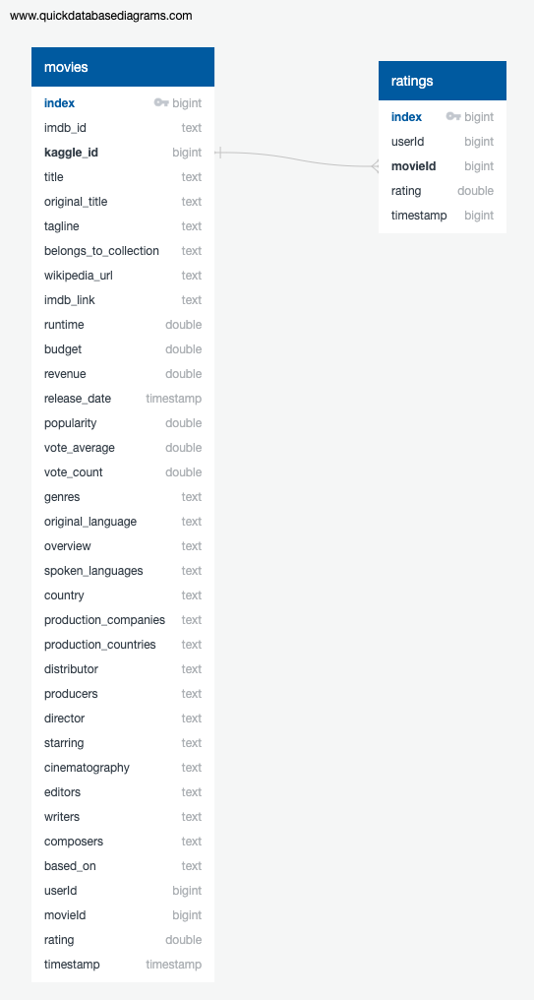

# Movies-ETL
Amazing Prime Video, the worlds largest streaming video service would like to develop an algorithm to determine which low buidget movie will become popular. The company will host a hackathon of teams of developers to produce the algorithm. Our mission is to prepare the dataset the developers will use during the event and prodcue an ETL pipeline to update the data daily. 

## Resources
* [Wikipedia Data](https://courses.bootcampspot.com/courses/137/files/14478/download?wrap=1)
* [Kaggle Data](https://www.kaggle.com/account/login?returnUrl=%2Frounakbanik%2Fthe-movies-dataset%2Fdata)
* 
* 
* Databe ERD
*

## Data Assumpitons
* The wikipedia and Kaggle datasets will remains in the same format. 
* Kaggle data is more complete however the wikipedia dataset has information on some movies where Kaggle does not. The following columns include the kaggle data filled in with Wikipedia data.
  * running_time
  * budget_wiki
  * box_office
* The following Wikipedia columns were dropped in favor of the Kaggle dataset. 
  * title_wiki
  * release_date_wiki
  * Language
  * Production company(s) 
* The company is not interested in analysis of Adult movies. Movies in the Adult category will excluded form the dataset.
* Developers in the hackathon will create a local Postgres database to load the data with name: movies_data.
* The final data pipeline will be executed programatically, with out user interaction. System administrators will change the loggin level to Warning and above when scheduling the pipeline.

